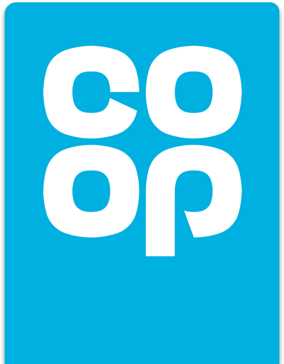

# Coop Design System - Official React UI Library

## Tech stack

Building components

- 📚 [Storybook](https://storybook.js.org) for UI component development and [addon docs](https://medium.com/storybookjs/storybook-docs-sneak-peak-5be78445094a).
- 🎨 [Sass](https://sass-lang.com/) for component styling.
- ⚛️ [React](https://reactjs.org/) declarative component-centric UI.
- 👨‍🔬[Jest](https://jestjs.io/) and [react-testing-library](https://testing-library.com/) as testing frameworks.
- 🥼 [Playroom](https://github.com/seek-oss/playroom) for quick scaffolding of pages using storybook react components.

System maintenance

- 🗃️[Babel](https://babeljs.io/) for bundling code into our React library.
- 📦[Yarn](https://classic.yarnpkg.com/) for package dependency management.

Other

- Jest support
- Typescript support
- Webpack/Babel
- eslint/prettier
- Playroom
### Why

This library codifies existing [Coop web components](https://coop-design-system.herokuapp.com/) into React components. It is built to address having to paste the same components into multiple projects again and again. This simplifies and speeds up building React apps throughout the Coop ecosystem.

### What

- Build and maintain the Coop React UI components
- Share those components between multiple apps

**Current supported components**

- Alert
- BlockQuote
- Button
- FormContainer
- FormValidation
- Grid
- GridItem
- Hero
- InputCheckbox
- InputCheckboxGroup
- InputDOB
- InputRadio
- InputRadioGroup
- InputSelect
- InputText
- InputTextArea
- List
- MembershipBanner
- ResponsiveImage
- Text

### Playroom

Playroom allows you to create a zero-install code-oriented design environment, built into a standalone bundle that can be deployed alongside your existing design system documentation.

We've added playroom to the `npm start | yarn start` scripts using [npm-run-all](https://github.com/mysticatea/npm-run-all).  This allows us to run both storybook and playroom in parallel.
